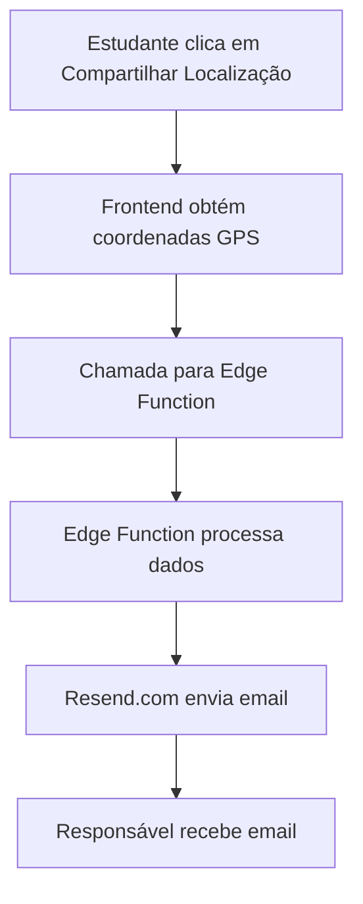

# Problemas no Compartilhamento de Localização - EduConnect

## Visão Geral do Sistema
O EduConnect possui uma funcionalidade essencial que permite aos estudantes compartilhar sua localização atual com seus responsáveis cadastrados. Esta funcionalidade é implementada através de:

1. Frontend React (GuardianList.tsx)
2. Edge Function Supabase (share-location)
3. Serviço de Email (Resend.com)

## Desafios Atuais

### 1. Configuração do Serviço de Email
- **Status Atual**: A Edge Function está configurada mas não está funcionando corretamente
- **Problema**: Falta da variável de ambiente `RESEND_API_KEY` no ambiente de produção
- **Impacto**: Os emails não estão sendo enviados aos responsáveis

### 2. Fluxo do Sistema
O sistema está estruturado da seguinte forma:

### 3. Pontos de Falha Identificados

#### 3.1 Frontend (src/components/GuardianList.tsx)
- ✅ Obtém coordenadas GPS corretamente
- ✅ Interface mostra feedback visual do processo
- ✅ Envia dados para a Edge Function

#### 3.2 Edge Function (supabase/functions/share-location/index.ts)
- ✅ Código implementado corretamente
- ✅ Validações de dados implementadas
- ❌ Variável de ambiente RESEND_API_KEY não configurada
- ❌ Não consegue enviar emails devido à falta da chave API

#### 3.3 Serviço de Email (Resend.com)
- ❌ Não configurado completamente
- ❌ Necessita de cadastro e geração de API key
- ❌ Falta integração com o domínio sistema-monitore.com.br

## Próximos Passos

1. **Configuração do Resend.com**
   - Criar conta no Resend.com
   - Gerar API key
   - Verificar domínio sistema-monitore.com.br

2. **Configuração da Edge Function**
   - Adicionar RESEND_API_KEY às variáveis de ambiente do projeto
   - Testar envio de email com dados fictícios
   - Implementar monitoramento de erros

3. **Testes de Integração**
   - Testar fluxo completo em ambiente de desenvolvimento
   - Verificar entrega dos emails
   - Validar formato e conteúdo dos emails

## Impacto no Usuário

Atualmente, quando um estudante tenta compartilhar sua localização:
1. O botão de compartilhamento funciona
2. As coordenadas são obtidas corretamente
3. A interface mostra que está processando
4. Mas o email não é enviado devido à falta da configuração do Resend

## Solução Proposta

1. **Curto Prazo**
   - Configurar Resend.com imediatamente
   - Adicionar RESEND_API_KEY ao projeto
   - Realizar testes iniciais

2. **Médio Prazo**
   - Implementar sistema de retry para emails falhos
   - Adicionar logs detalhados
   - Criar dashboard de monitoramento

3. **Longo Prazo**
   - Considerar implementar sistema de notificação alternativo (SMS/WhatsApp)
   - Melhorar interface de feedback ao usuário
   - Implementar sistema de agendamento de compartilhamento

## Monitoramento

Para identificar e resolver problemas rapidamente, precisamos:
1. Configurar logs detalhados na Edge Function
2. Monitorar taxa de sucesso dos envios
3. Implementar alertas para falhas consecutivas
4. Manter histórico de tentativas de envio

## Conclusão

O sistema está tecnicamente bem implementado, mas está bloqueado pela falta da configuração do serviço de email Resend.com. A solução é relativamente simples, mas requer acesso administrativo para configurar as variáveis de ambiente no projeto Supabase. 